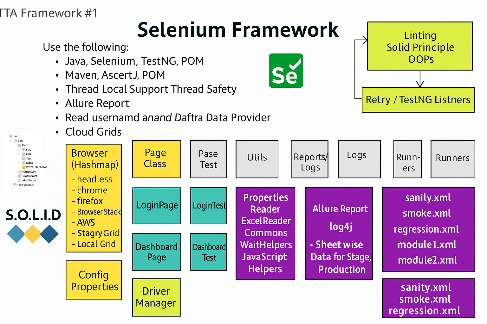

# **Advanced Selenium Automation Framework (Java)**

###### Author- Kavya Sree Vuragayala

A lightweight, fast, and scalable test automation framework built using Java, Selenium, and TestNG, designed for parallel execution and cloud/grid compatibility.

## 🚀 **Tech Stack**

1. Java 8+ 
2. Selenium WebDriver 
3. TestNG
4. Maven
5. AssertJ
6. Allure Report
7. Page Object Model (POM)
8. ThreadLocal WebDriver (Thread-safe)
9. Excel DataProvider + Properties File
10. Selenoid (Docker Grid)

## 🔥 **Features**

1. Parallel execution with ThreadLocal driver
2. POM-based design for maintainability
3. Config-driven tests using properties file
4. Data-driven testing (Excel + TestNG DataProvider)
5. Local & Remote execution (Selenoid, Selenium Grid)
6. Allure reporting with screenshots
7. CI/CD friendly structure (Jenkins/GitHub Actions)

mvn test -Dsurefire.suiteXmlFiles=testng.xml

## **Seleniod - Docker Grid Running**

* Selenoid is a powerful tool for running Selenium tests in Docker containers.
* which can help you manage and scale your test automation infrastructure more efficiently.

